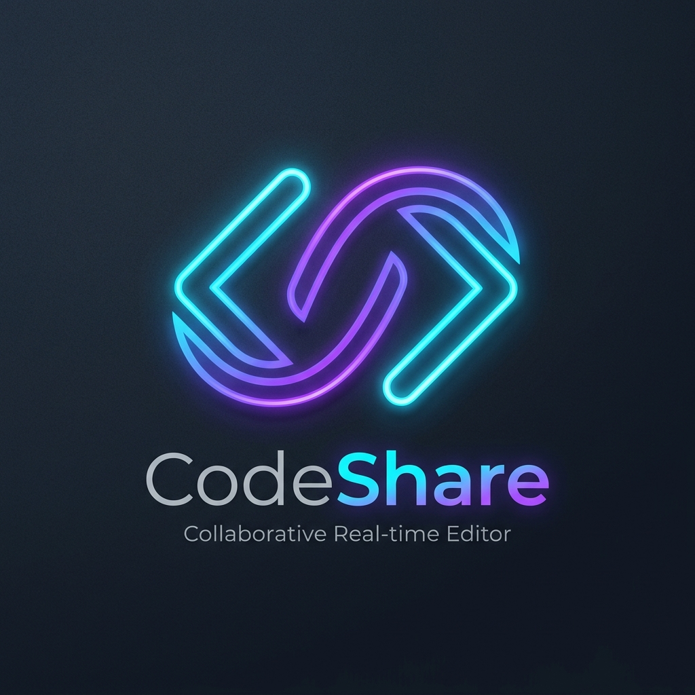
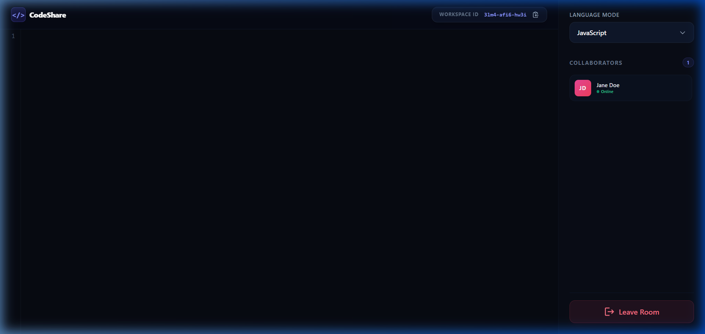

# CodeShare

<!-- PROJECT LOGO -->
<br />
<p align="center">
  

  <h3 align="center">CodeShare</h3>

  <p align="center">
    <br />
    <a href="https://github.com/kenildhola010/code_share/issues">Report Bug</a>
    ·
    <a href="https://github.com/kenildhola010/code_share/issues">Request Feature</a>
  </p>
</p>


<!-- TABLE OF CONTENTS -->
<details open="open">
  <summary>Table of Contents</summary>
  <ol>
    <li>
      <a href="#about-the-project">About The Project</a>
      <ul>
        <li><a href="#features">Features</a></li>
        <li><a href="#built-with">Built With</a></li>
      </ul>
    </li>
    <li>
      <a href="#getting-started">Getting Started</a>
      <ul>
        <li><a href="#installation">Installation</a></li>
      </ul>
    </li>
    <li><a href="#contributing">Contributing</a></li>
    <li><a href="#contact">Contact</a></li>
  </ol>
</details>


<!-- ABOUT THE PROJECT -->
## About The Project
 

### Features

- This project is a collaborative software platform designed to enhance the process of sharing, reviewing, and collaborating on code among developers and teams.  <br />
- This is accelerating the software development lifecycle.<br/>
- It has functionalities like user can create their own room with room id and username. Room id is randomely generated using uuid and it is always unique.<br/>
- Multiple users can join to the room and write & share their code in real time with their room members.They can also change the language according to their project.<br/>
- They can also see how many users are present in their room.<br />
- If all the users leave the room and then come back to the same room then the data will be remained in the room.They can get their original data in the same form.<br/> 

### Built With

* [NodeJS](https://nodejs.org/en/)
* [ExpressJS](https://expressjs.com/)
* [ReactJS](https://reactjs.org/)
* [Socket.io](https://socket.io/)
* [MongoDB](https://www.mongodb.com/)

<!-- GETTING STARTED -->
## Getting Started

This is an example of how you may give instructions on setting up your project locally.
To get a local copy up and running follow these simple example steps.

### Installation


Fork, then download or clone the repo.
```bash
git clone https://github.com/kenildhola010/code_share.git
```

For the **back-end**, install the dependencies once via the terminal.
```bash
cd server
npm install
```

Create .env file in backend server folder and set the below code.
```bash
FRONTEND_URL = (Insert your frontend uri like this - http://localhost:5173/ for this project)
```

If you want to run the **back-end**, go to *backtend* folder via the terminal.
```bash
npm run start
```

For the **front-end**, install the dependencies once via the terminal.
```bash
npm install
```

Set the below code in .env file as well.
```bash
PORT = 3000

```
Set the.env file for MongoDB.
```bash
MONGODB_URL= YOUR MONGODB URL
```

If you want to run the **front-end**, go to *frontend* folder via the terminal.
```bash
npm run dev
```

Now you are ready to run the server and frontend.

<br />

<!-- CONTRIBUTING -->
## Contributing

Contributions are what make the open source community such an amazing place to be learn, inspire, and create. Any contributions you make are **greatly appreciated**.

1. Fork the Project
2. Create your Feature Branch (`git checkout -b feature/AmazingFeature`)
3. Commit your Changes (`git commit -m 'Add some AmazingFeature'`)
4. Push to the Branch (`git push origin feature/AmazingFeature`)
5. Open a Pull Request


<!-- CONTACT -->
## Contact

Kenil Dhola - [@kenildhola010](https://github.com/kenildhola010)

Project Link: [https://github.com/kenildhola010/code_share](https://github.com/kenildhola010/code_share)


<!-- MARKDOWN LINKS & IMAGES -->
<!-- https://www.markdownguide.org/basic-syntax/#reference-style-links -->
[product-screenshot]: images/screenshot.PNG
